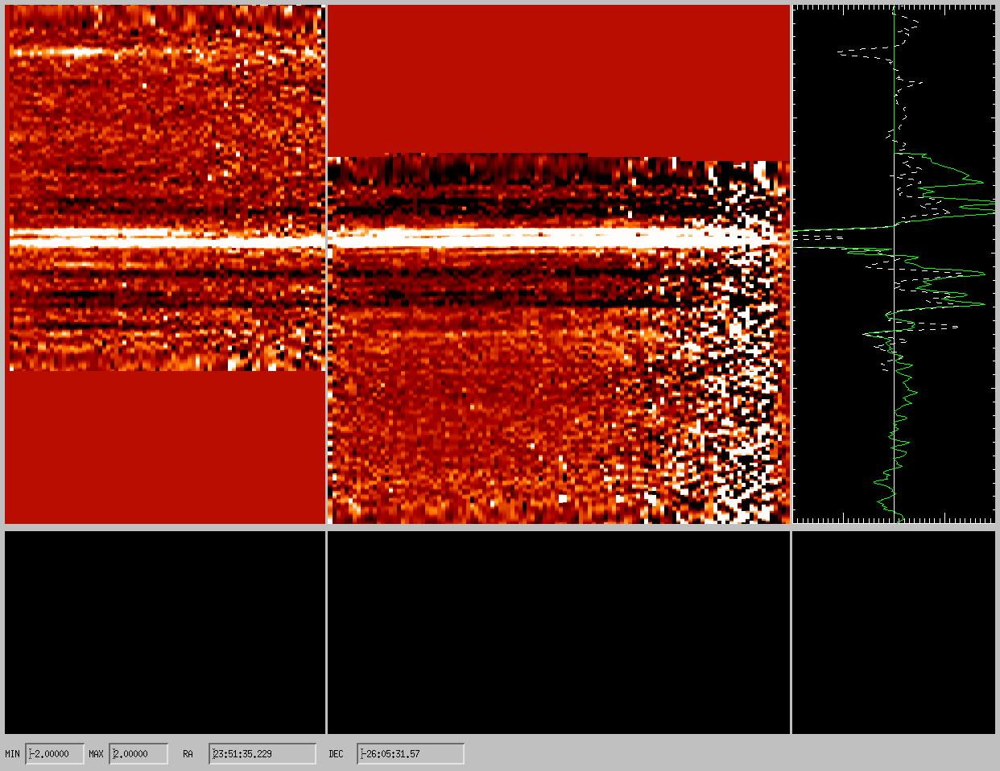
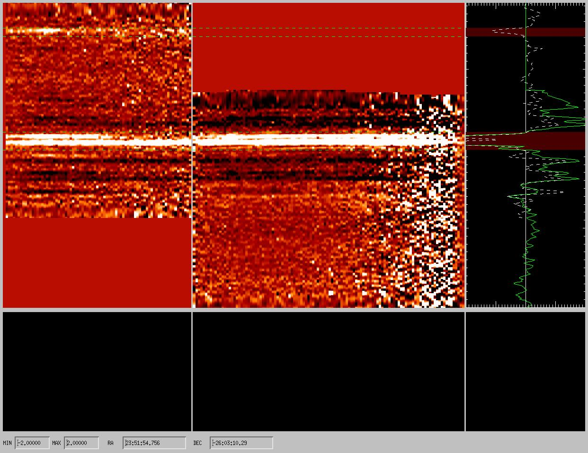
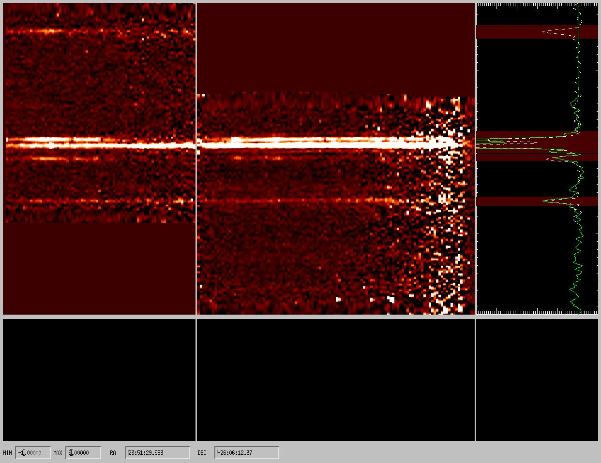
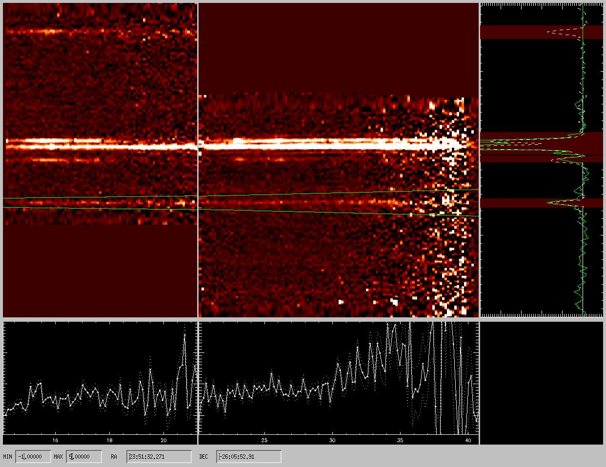
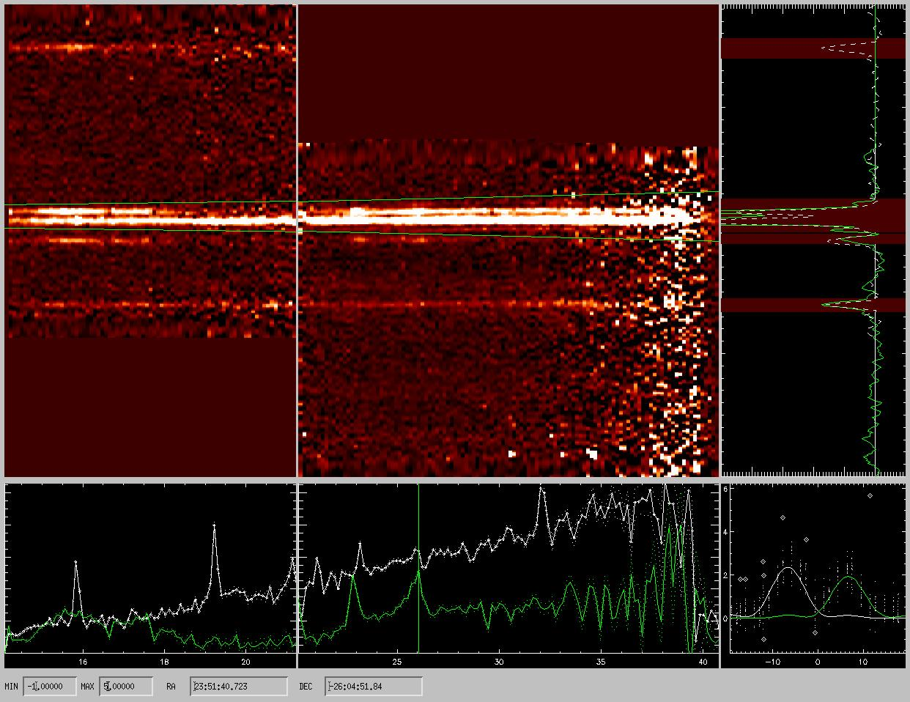

# irslow
An IDL  tool to coadd and extract low-resolution IRS spectra taken with the Spitzer telescope

IrsLow is an IDL code to extract spectra from IRS (Spitzer) low-resolution observations. The code is presented in [Fadda et al. 2010 ApJ 719:425](http://adsabs.harvard.edu/abs/2010ApJ...719..425F).

The code starts from the BCD level, computes and subtract a background, finds and removes rogue pixels and outliers. Finally, it is possible to reject interactively bad pixels, and extract the spectra. The extraction is done using PSF fitting. 

## A tutorial

After cloning the git repository on your computer:

git clone https://github.com/darioflute/irslow.git

you will start IDL, add to the path the place where you cloned the repository, and start the code.
For instance, if you clone the repository in your root directory, you will write:

!path += ":\~/irslow/:~/irslow/bspline/"

to add to your path irslow and the directory with the spline codes from IDLUTILS.

The directory called spice contains the most uptodate distribution of IRS calibration. This can be retrieved at
the [official spice website](http://irsa.ipac.caltech.edu/data/SPITZER/docs/dataanalysistools/tools/spice/).

Running the software is pretty easy. First, execute irslow to insure that all subroutines are active.

.r irslow

You also need the list of the BCDs covering the source (from one or more AORs) in the long-low or in the short-low mode. 
If you downloaded bcd files of one AOR in the path: /path/r00000000, you can get the names by writing:

list=file_search('/path/r00000000/ch0/bcd/*bcd.fits') 

or, if you have more AORs, 

list = [file_search('/path/r00000001/ch0/bcd/*bcd.fits'),file_search('/path/r00000002/ch0/bcd/*bcd.fits')] 

The, run the code: 

irslow, list 

if long-low data (channel 2) or 

IrsLow, list, /sl

in the case of short-low data (channel 0).

You will be presented with five windows: two windows containing the data in first and second order (central and left upper windows), a window with the profiles (right-upper window), two windows which will display the extracted spectra (central and left lower window) and a window to examine the PSF fits on a single wavelength (lower-right window). 

 You can click "c" on the limits of a spectrum on the profile window to clip out the sources. Green lines will show the regions clipped and the background of the profile, in the same regions, will change color.

Now, with "b" we can recompute the background excluding the region with sources and subtract it again from the images. This passage can be repeated until a satisfactory background removal is done. The minimum and maximum of the displayed image can be changed by inserting new values in the two lower-left boxes (MIN and MAX). Remember to hit return after inserting the new values. To unclip a region, just click "C" including the limits of the clipped region. 

Sometimes, the two orders are not well aligned. To force the alignment, click "a" on the top of the same source in the two orders. A shift will be computed and applied to the data. This step is essential to guarantee a good extraction. Once satisfied, clicking "x" on the profile you can extract a spectrum of an isolated source. 

The extracted spectra of the two orders appear below the images. In case of 2 close spectra, a simultaneous fit of two PSFs can be performed by clicking 2 on the top of each close profile peaks.

In this case, two spectra (white and green) will appear in the windows. The spectra will be saved as ASCII files with names corresponding to their coordinates containing: order, wavelength (micron), flux (Jy), flux error and number of points used for the fit.

It is possible to inspect the PSF fitting clicking on one point of the spectrum. 

In the smallest window, the points used for the fit and the fitted PSFs will appear. Points surrounded with diamonds are discarded (outliers) or hot pixels if the diamond is green. It is possible to further perfect the fit by deleting ("d") or undeleting ("u") some points and then redo the fit ("f"). If the new fit appears to be better, it is possible to save the result with "s". Sometimes it can be useful to resize the small window to better see the points. In this case, click "w" on the lower and upper limits of the part of the window you want to select. Clicking "W" you can see again all the points involved.

To leave the code, just click "q" for quit. To have some help on line, click h,H,or ? on the window you are using.

## Acknowledgements

IrsLow has been developed by [Dario Fadda](https://sites.google.com/site/darioflute/). If you use this software, please quote the following paper: [Fadda et al., 2010, ApJ, 719, 425](http://adsabs.harvard.edu/cgi-bin/nph-bib_query?bibcode=2010ApJ...719..425F&data_type=BIBTEX&db_key=AST&nocookieset=1). 
